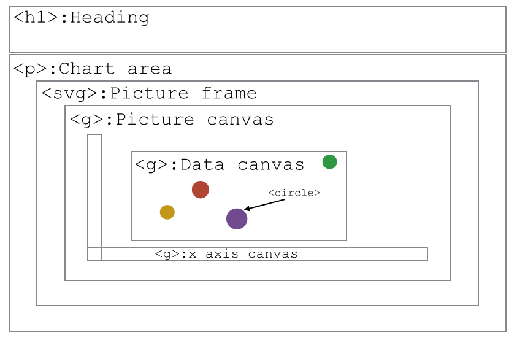

> ### Learning Objectives
>
> * Setting up an html file to contain the plot
> * Reading in data from a given `.json` file
> * Structuring the html content

We've finally learned everything we need to know to start using D3.
D3 is a JavaScript library. This means that we can use all of the JavaScript commands that we have already learned, but on top of these, there are a few new functions that will make our life easier.

The main purpose of D3 is to create visualisations of data online. Because it uses JavaScript, it is possible to make graphs interactive!

As a little refresher, we will repeat a little bit of HTML to set up our page.

Create a new GitHub repository and create a `gh-pages` branch to which you commit. This is, where our actual page will live. Then create `index.html` in the new repository containing the following:

```html
<!DOCTYPE html>
<html>
  <head>
    <title>The Wealth & Health of Nations</title>
    <link rel="stylesheet" type="text/css" href="main.css" />
  </head>
  <body>

    <h1>The Wealth & Health of Nations</h1>

    <p id="chart_area"></p>

    <script src="d3.min.js"></script>
    <script src="main.js"></script>
  </body>
</html>
```

There are a few things in this file that look new:
- `<link rel="stylesheet" type="text/css" href="main.css" />` is linking the local CSS file `main.css` (this should already exist in your `getting_started/code` folder);
- `<script src="main.js"></script>` is linking the JavaScript file, the file in which all the action will happen. Let's create an empty `main.js` in `getting_started/code` for now.
- `<script src="d3.min.js"></script>` is linking the d3 library (already included in `getting_started/code`). The order of these `<script>` lines matters, as these lines are executed sequentially and we want to use parts of the D3 library in our own script, we have to load in `d3.min.js` first.

The last bit, that's important here is an HTML element (paragraph) we create. We give it an id `chart_area`. This is the area we reserve for our pretty chart. We will use JavaScript (and D3) to fill it in.

> ### Challenge: Try it out!
>
> This is not the most interesting challenge, but we have to see that everything works. Navigate to `getting_started` and type `live-server` in the terminal (make sure you run this in `getting_started` and not within `code`). If you're on a Windows machine, you may need to start a "nodejs" terminal. Your browser should open a new tab displaying your folder structure. Click on `code`. If everything goes according to plan, you should see the text "The Wealth & Health of Nations" appear. Also, check the console for any errors... (right-click anywhere and click `inspect element` to open it). Live-server will keep this tab up to date if we change anything in the code. So there's no need to close the tab.

Now, let's add some code to main.js.

Similar to the syntax we've already seen (`JSON.stringify`), D3-specific functions can be called using a `d3.`-syntax.

The first thing we need, is of course our data, which we can find at `data/nations.json` in our `getting_started` folder. D3 provides a handy function to read in `json`-files:

```js
d3.json('../data/nations.json', function(nations) { })
```

This line probably needs a little explanation and we'll go through it bit by bit:

* `d3.json()` is called the function call. In this case, we have a function that reads in a json file, parses it, and is also able to do something with the parsed data on the way.
* The first argument `dataUrl` tells the function where to get the data we want to have parsed.
* `function(...){...}` is called the callback function. It is a so-called 'inline' function, which means it has no name (we're only operating in the object space here). This also means we can't use this function anywhere else in our code. The code we put inside the curly brackets is the code that's run once d3.json() is called and the data is loaded.
* D3 assigns the name `nations` to the parsed object it returns. We can only use 'nations' within the callback function, this means our code only knows of `nations` inside the curly brackets.
* What seems unusual, but is actually quite common, is that this function call doesn't return anything. It is simply executed and displayed (if we tell it to), but no value is returned.

> ### Note: What else can I read in conveniently?
> D3 offers the possibility to also read in csv (comma-separated values) files directly. See [here](https://github.com/mbostock/d3/wiki/CSV) for an example. Also available are functions to read in tab-separated values (tsv) and files with arbitrary delimiter (dsv).

So naturally, the next step is to think about what we want to happen between the curly brackets. For now, we want to:

* Link JavaScript to HTML page
* Insert an SVG canvas
* Create axes (x: income per capita, y: life expectancy)
* Display data points (scatter plot)

First, let's draw a little schematic of how we want the page to be structured.



We already set up our HTML page to contain a chart area. That's the space we want to fill now. We'll have a picture frame (an [SVG-element](../web-course/3-images-and-svg)), our drawing area (a g-element), and in that drawing area, we'll have separate elements for both axes and the area for our circles.

> ### Note: Why SVGs?
>
> We're trying to create a data-driven graph, made up of objects such as lines, circles, and squares (not photos of cats). We could just find an image of a circle and use this to represent the data by scaling and positioning it on the page, but that might not be the best way. An image is an inefficient way to represent lines and circles and your webpage would spend an unnecessary amount of time downloading each of these image files.
>
> SVGs (Scalable Vector Graphics) are a better way to include graphical elements that aren’t photos. They are a much more efficient way to store these shapes and, regardless of the screen and size of these shapes, they will never be pixelated (that's what vector graphic means).

What we now want to end up with in our html document is this:

```html
<p id="chart_area"> <svg> </svg> </p>
```

But this time, we want to create these elements automatically using JavaScript only.
First, we need to link the JavaScript and HTML environment so that we have writing access
to the HTML.
To do this, we use the `.select()`. This lets us grab an element by specifying its ID.

```js
// Select the chart area by ID
var chart_area = d3.select("#chart_area");
```

Now we're setting up the grid by appending the chart area by the SVG picture frame.

```js
var frame = chart_area.append("svg");
```

in the HTML file. We chose to append because we now have access to the SVG element without the need to separately select it by ID.

We also create the canvas inside the frame:

```js
// Create canvas inside frame.
var canvas = frame.append("g");
```

Let's set up the dimensions for our elements that we want to use:

```js
// Set margins, width, and height.
var margin = {top: 19.5, right: 19.5, bottom: 19.5, left: 39.5};
var frame_width = 960;
var frame_height = 350;
var canvas_width = frame_width - margin.left - margin.right;
var canvas_height = frame_height - margin.top - margin.bottom;
```

...and apply them to the actual elements:

```js
// Set frame attributes width and height.
frame.attr("width", frame_width);
frame.attr("height", frame_height);
```

The canvas element will have to fit nicely into the frame. To make it fit, we set a transform attribute and use the translate function.

```js
// Shift the canvas
canvas.attr("transform", "translate(" + margin.left + "," + margin.top + ")");
// and make it slightly smaller than the svg canvas
canvas.attr("width", canvas_width);
canvas.attr("height", canvas_height);
```

> ### Challenge: Adding SVGs from JavaScript file
> 1. Add a SVG circle element to the frame.
> 1. Once the circle reference is obtained, make the radius 40, the border black, and the colour green (look out: SVG uses different names to refer to these [properties](https://www.w3schools.com/graphics/svg_circle.asp)).
> 1. Position the circle so that it isn't cut off by the edges of the canvas.
>
> HINT: You can use the `attr` method on the circle object obtained.

> ### [Next Lesson: Showing data](./3-enter)
