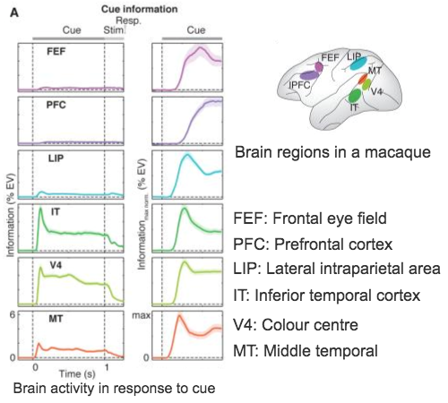

When we publish research, our figures are often created to look good on paper. They are small, possibly greyscale, and, most importantly two-dimensional. But what, if our data is three-dimensional? Displaying data in more dimensions can give us and the readers the possibility to explore and understand our data in a more intuitive way.

While plotting libraries are designed to create specific types of visualisations, Three.js allows you to create any visualisation you like. These can be three-dimensional and easily be animated, so we're not just adding another spatial, but also a temporal dimension. Three.js is a JavaScript library, which is good, because every browser can interpret our JavaScript code. It makes use of an in-built feature of many browsers called WebGL, which is optimised for displaying 3D visualisations (even allowing access to the user's graphics card for better performance and smoother animations).

In this course, we want to visualise some data that was published in the Science journal. In [this paper](https://www.ncbi.nlm.nih.gov/pmc/articles/PMC4721574/), the authors show how different brain regions of a monkey respond to a visual cue. We'll set up a scene in which we'll show a monkey brain. On this brain, we'll add expanding and contracting spheres to display the measured brain activity. Clicking on any of these active brain regions will show a 2D trace of this activity similar to the traces in the original paper. And since it's all in 3D space, we'll add controls to make it easy for the user to move around in the scene and we'll add some cozy lighting. 

> ### Prerequisits and getting started
>
> You will need: 
> * basic knowledge of Javascript. Check out [this course](../web-course/) for a refresher. 
> * your prefered text editor, like [sublime](https://www.sublimetext.com/) or [atom](https://atom.io/)
> To get started, download the files in [this folder](./getting_started.zip)
> The resulting code of all lessons lives in our [GitHub repo](https://github.com/RobIsaTeam/courses/tree/master/_course_3_threejs/code). If you're stuck on a challenge, you can check out the solutions in the according file.

This is the paper's data we want to display in 3D:

Modified from [Figures 1 and 2 of the publication.](https://www.ncbi.nlm.nih.gov/pmc/articles/PMC4721574/)

And this is the visualisation we will have by the end of this course :
<iframe style="position: relative; left: -120px; overflow: hidden;" scrolling='no' src="code/final.html" width="1000" height="600"></iframe>
