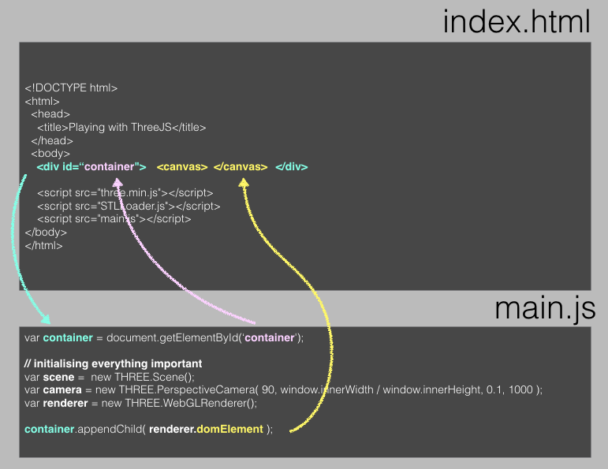

> ### Learning objectives:
>
> * Setting up an environment that allows us to view 3D objects using ThreeJS
> * Using a scene, a camera, and a renderer

Before we start doing anything visual, we need to set up our main html file ('index.html') in 'code' folder.
We need to link to the ThreeJS library as well as a [loading module](https://raw.githubusercontent.com/mrdoob/three.js/master/examples/js/loaders/STLLoader.js) to read in 3D object files. We'll also go ahead and include another file straight away - 'main.js' - a file that will contain our own code.

Then, we insert a `div` element that we will use to display our scene in and give it the ID 'container'.

```html
<!DOCTYPE html>
<html>
  <head>
    <title>Playing with ThreeJS</title>
    <style>
		* { margin: 0; padding:0;}
		canvas { width: 100%; height: 100% }    	
    </style>
  </head>
  <body>

  	<div>All good, we're ready to get started.</div>

    <div id='container'> </div>

    <script src="three.min.js"></script>
    <script src="main.js"></script>
  </body>
</html>
```

> ### Challenge: Try it out!
>
> This is not the most interesting challenge, but we have to see that everything works. Navigate to `getting_started` and type `live-server` in the terminal (make sure you run this in `getting_started` and not within `code`). If you're on a Windows machine, you may need to start a "nodejs" terminal. Your browser should open a new tab displaying your folder structure. Click on `code`. If everything goes according to plan, you should see our friendly message. When you're done, delete the message `div` from `index.html`. Also, check the console for any errors... (right-click anywhere and click `inspect element` to open it). Live-server will keep this tab up to date if we change anything in the code. So there's no need to close the tab.

Now to the more exciting part: ThreeJS! Before we can start displaying things on the screen, there are a few things we need to do: we need to tell our browser where our 3D objects will live and which angle we're looking at them from. To display any object, we need to do three things:

* set up a scene object using `Scene`
* set up a camera object using e.g. `PerspectiveCamera`
* set up a rendering object e.g. `WebGLRenderer`

Let's go through the dot points one by one:

***Scene:***
The scene is a 3D space that we set up and that will contain all our 3D objects we create. The function we use to create a scene is `THREE.Scene()`.

***Camera:***
The camera is our point of view. The function we use to create a camera object is `THREE.PerspectiveCamera()`.

***Renderer:***
The scene and any objects in it are only visible to us through the camera. And what we see through the camera needs to be drawn in two dimensions onto our page. This is the task of the renderer: it's taking what the camera sees in the scene and draws it in 2D in our browser. If the camera (position, direction, or aspect ratio) changes or we insert or move objects in the scene, we will have to re-draw this 2D image which means we re-render the page.
The function we use to create the rendering object is `THREE.WebGLRenderer()`.

ThreeJS is programmed in a way that requires us to use the `new` keyword to create new ThreeJS objects like these three. That's not the case for all JavaScript libraries and it's just a design choice the creators made.

In our JavaScript file 'main.js', we start setting the scene:
```js
var scene =  new THREE.Scene();
var camera = new THREE.PerspectiveCamera( 90, window.innerWidth / window.innerHeight, .1, 1000 );
var renderer = new THREE.WebGLRenderer();
```

We have given the camera a few default parameters - don't worry about them for now, we'll play with them later.

To be able to draw the 2D projection of our 3D objects, the renderer creates its own canvas `<canvas></canvas>` which we will need to insert into the page, more precisely, inside the `<div>` container we set up before. We're doing this using `appendChild()`. Each HTML element can have any number of "children" who can have children of their own. Think of the structure like russian dolls (or turducken)... except if they could have siblings. Nevermind... Each child has one parent, the HTML element it's contained within.

And while we're at it, we'll make the canvas as large as the browser window:

```js
var container = document.getElementById('container');

container.appendChild(renderer.domElement);
renderer.setSize(window.innerWidth, window.innerHeight);
```

Upon saving the tab's background colour should change from white to black.

If that's confusing, that's ok. This image shows the result of appending the canvas child in yellow.


> ### [Next Lesson: Adding an object](./3-objects)
