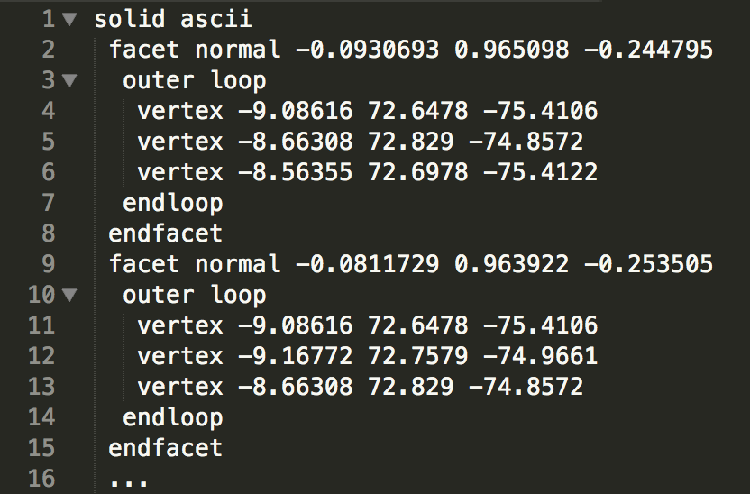
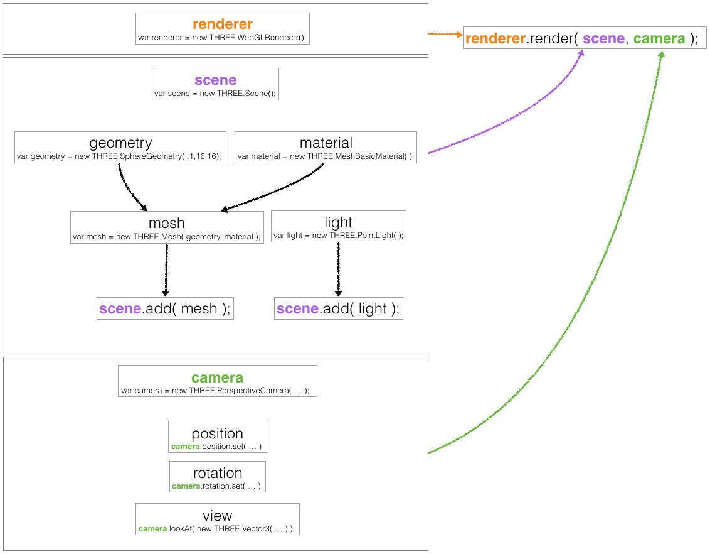

> ### Learning objectives:
>
> * loading an STL file
> * rendering a 3D object, using a mesh and a basic material
> * deeper understanding of camera attributes and object positioning

Great, we have a scene, a camera pointed at it, nothing to look at, yet.
Luckily we have our [3D object](https://www.thingiverse.com/thing:1233641), a monkey's brain ready to go in our `data` folder.

The file we're loading is an `STL` file. In principle most useful 3D files (`.obj`, `.stl`, `.json`) describe a surface made up of many tiny triangles. Each triangle has vertices and a face normal vector. The vertices are the corner points of the triangle in 3D space, the face normal vector defines which side of the triangle is the in- and which side is the outside and is needed by ThreeJS to deal with lighting and shading.



We want to load this 3D file using the `THREE.STLLoader()` function, which isn't part of the core Three.js library. To use it we first need to include an extra file in `index.html`:
```html
  <script src="three.min.js"></script>
  <script src="STLLoader.js"></script>
  <script src="main.js"></script>
```

When we load in a file, we'll have to wait until it has finished loading before we can assign a material to it and add it to the scene. Whenever we need to wait until an earlier step has finished, an easy way to do this is to use a callback function:

```js
var loader = new THREE.STLLoader();
loader.load('../data/MonkeyBrain.stl', function(geometry) {
  console.log(geometry)
});
```

Again, we are creating a ThreeJS-specific object (a loader), which means we use the `new` keyword. `THREE.STLLoader()` provides a `load()` function. Its arguments are the path to the file and a callback function for the loaded geometry. For now, all we want to know is if the file was loaded at all, and we can use a `console.log()` to find out.

> ### Challenge: Other file loaders
> Have a look at the [other file loaders available]( https://github.com/mrdoob/three.js/tree/master/examples/js/loaders) to see what some other file formats are we could be loading? Try finding other sources of 3D files on the internet, check their format, and share what you've found.

We can't show an object that doesn't have a material assigned. ThreeJS comes with a whole range of predefined materials. For now, we'll use a very basic one: `MeshNormalMaterial`. Any material has a whole range of attributes that we can define.

From here on, all code that needs the brain to be loaded in order to work will need to be in the callback function of the loader.

We'll create our material:

```js
var material = new THREE.MeshNormalMaterial({visible: true});
```

Now we can finally create our object form the loaded geometry and our material. ThreeJS, like many other 3D tools, think of objects in terms of a mesh. So we're creating this mesh, and add it to the scene, using `scene.add()`:

```js
var mesh = new THREE.Mesh(geometry, material);
scene.add(mesh);
```

The last step now is to render our scene. Our renderer expects a scene and a camera and our scene contains our brain:

```js
renderer.render(scene, camera);
```

For a little recap of what we did and how everything relates, have a look at this image. Even though there might be parts that we haven't covered yet, it will also be useful as a reference later.



> ### Challenge: Play with the material
> The material we use is documented [here](https://threejs.org/docs/index.html#api/materials/MeshNormalMaterial). Make the brain transparent.
> Then try using [MeshBasicMaterial](https://threejs.org/docs/index.html#api/materials/MeshBasicMaterial) and see if you can make the wireframe visible.

Here is what the scene should look like by the end of this lesson:
<iframe style="position: relative; left: -120px; overflow: hidden;" scrolling='no' src="code/lesson-03.html" width="1000" height="600"></iframe>

> ### [Next Lesson: Changing the camera angle](./4-camera)
