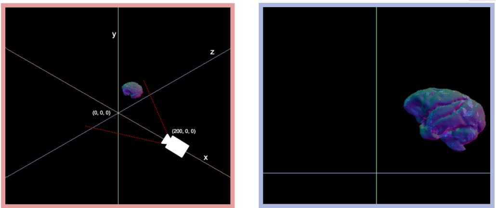
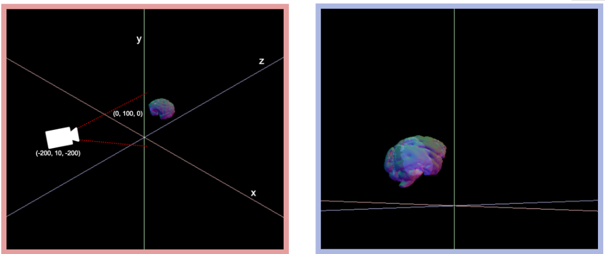
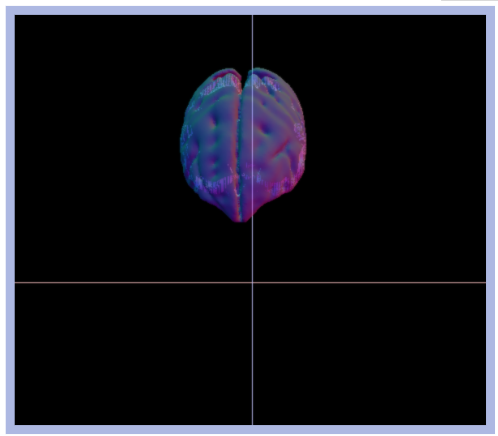

> ### Learning objectives:
>
> * understand the perspective of the camera.
> * set the position of mesh and camera.
> * adding axes.

At the moment, we're only seeing half the brain. To fix that, we'll need to understand our camera a little bit better.
When we initiated the camera, we gave it some default parameters. If we look at the [ThreeJS documentation](http://threejs.org/docs/api/cameras/PerspectiveCamera.html) we find out what parameters we have to pass to the camera: `PerspectiveCamera( fov, aspect, near, far )`.

**`fov`** is vertical field of view. If it's bigger, it's like a wide-angle / fishbowl lens. If it's smaller, the less you notice that there is a perspective at all and things seem to have less depth.

**`aspect`** is the aspect ratio of the screen.

**`near`** and **`far`** set the distance at which things get cut off. `far` can be huge, `near` can be tiny unless you want them to be something else for artistic reasons.

This [image](https://www3.ntu.edu.sg/home/ehchua/programming/opengl/CG_BasicsTheory.html) might help to get a better understanding about what's going on:


We'll start with these parameters:

```js
var camera = new THREE.PerspectiveCamera( 80, window.innerWidth / window.innerHeight, 0.1, 100000 );
```

> ### Challenge: Play with the camera!
>
> Play with the parameters of the camera to see if you can get an intuition for how they work. Can you set them in a way that you cut through the brain? Can you make a fish eye lens?

One thing that you might have noticed while playing with the camera is that you always look at the brain from the same direction. All we know how to change are the distance and the aspect ratio. Let's have a look at where our camera actually is by printing its position in the console:
```js
console.log(camera.position);
```

One important thing I want to have if I'm in a 3D space is a reference system. ThreeJS doesn't come with a simple command to create axes, so we wrote a little script to help us with this. It should be in your `code` folder. To use it, we'll have to load it in the `index.html`. It needs to be included before the `main.js`, so we have access to its functionality in our main file.   

```html
<script src="three.min.js"></script>
<script src="STLLoader.js"></script>
<script src="makeAxes.js"></script> <!--  this one -->
<script src="main.js"></script>
```

To add the axes to the scene, call `addAxes(scene)` any time after creating the scene.
```js
addAxes(scene);
```
Three coloured axes should appear on your screen: x (red) and z (blue) being the plane we'd stand on and y (green) pointing up. 


Now we can set the camera position using `camera.position.set()` and giving it an x, y, and z coordinate:

```js
camera.position.set( 200, 0, 0 );
```

Once we move the camera, we can decide where it points to, using the `lookAt` command. This command is used with a ThreeJS vector, which is just another way of saying "this point in space". We'll come across more of these vectors later. We can either initialise it as a variable like we're used to, or we can create a new one on the fly (which is what we'll do here, because we won't need it a second time). 

For example, if we want to look at the origin of the coordinate system, we use:
```js
camera.lookAt( new THREE.Vector3( 0, 0, 0 ) );
```

Let's have a look at where we are in space and what we're looking at. The left image (red border) shows the camera position and rotation in space, the right image (blue border) shows us what this postition results in on our screen:


As a second example we're setting the position to a point just above the x-z plane and are looking at a point above the origin:
```js
camera.position.set( -200, 10, -200 );
camera.lookAt( new THREE.Vector3( 0, 100, 0 ) );
```



> ### Challenge: Look down on the brain
> Using `position` and `lookAt`, try recreating the following: 



Sooo... we could play with this for ever, create buttons to rotate, focus, zoom, and pan. But instead, we'll rely on a pre-built library that has all these controls conveniently packaged up already.

Before we move on though, let's end in a sensible spot:
```js
camera.position.set( -200, 200, -200);
camera.lookAt( new THREE.Vector3( 100, 10, 10 ) );
```

Here is what the scene should look like by the end of this lesson:
<iframe style="position: relative; left: -120px; overflow: hidden;" scrolling='no' src="code/lesson-04.html" width="1000" height="600"></iframe>

> ### [Next Lesson: Adding camera controls](./5-control)
