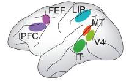

> ### Learning objectives:
>
> * Learn how to interact with the page using a [raycaster](https://threejs.org/docs/index.html#api/core/Raycaster)

In order to react with a 3D scene using our 2D display, we have to use a trick. We need to:

* track where our mouse cursor is in 2D
* project these coordinates throuhg our 3D space onto our objects

We do this by setting up a 'raycaster' object. Think of our 2D cursor as being on the glass surface of our 'window' into the scene. Now imagine parallel rays of light shining through the window. The cursor will cast a shadow onto our objects.


Let's start with the mouse coordinates. We need to create a vector with x and y coordinates that keeps track of out cursor's position whenever we move it. `THREE.Vector2` creates a 2D vector.

```js
var mouse = new THREE.Vector2();
```

To keep track of movement, we use the `mousemove` event and update our vector's coordinates. Every time the mouse moves, we'll want to execute a function we'll call 'onMouseMove'.

```js
window.addEventListener( 'mousemove', onMouseMove );
```

In that function, we'll update the x and y coordinate of our vector.
We can get the coordinate of our mouse using `event.clientX` and `event.clientY` and dividing it by the extent of our window in x and y direction (`window.innerWidth` and `window.innerHeight`).
This gives us values between 0 and 1 that we'll then have to transform into the right range. Curiously, according to html-standards, `event.clientY` starts at the top of the page with 0. ThreeJS and the raycaster treat the bottom of the window as y=-1 and the top as y=1. Similarly, the x-coordinate needs to be between -1 and 1 (left to right, same as `event.clientX`).

```js
var mouse = new THREE.Vector2();

function onMouseMove( event ) {
  mouse.x = ( event.clientX / window.innerWidth ) * 2 - 1;
  mouse.y = - ( event.clientY / window.innerHeight ) * 2 + 1;
  console.log(mouse)
}

window.addEventListener( 'mousemove', onMouseMove );
```

Next we want to set up the raycaster using `THREE.Raycaster`. And since we want to keep it up to date whenever we move the mouse, we'll modify it within the function we just wrote. What we have to do now is to get the raycaster to tell us where the 'shadow' of our cursor falls. Which means it needs to know the cursor's position `mouse` as well as our viewing direction, which coincides with where the camera is sitting. We can use the `.setFromCamera` method to set up our raycaster.

```js
var raycaster = new THREE.Raycaster();
function onMouseMove( event ) {

  mouse.x = ( event.clientX / window.innerWidth ) * 2 - 1;
  mouse.y = - ( event.clientY / window.innerHeight ) * 2 + 1;

  raycaster.setFromCamera( mouse, camera );
}
```

The raycaster is ready to go now. The most important method, and the one we'll use to find our what we're poining at is called `intersectObject`. It computes everything we might want to know about the where our shadow is in 3D space: distance to the camera, position in space, and the object we're pointing at. It's important to note that this works not only for the closest object we're pointing at, but that we can also get information about any object that's behind it at that same direction.

The `intersectObjects` method asks us to pick which object or objects we're interested in. In our case, we want to know about every object in the scene. We'll pass that in as the argument `scene.children`.

The last thing we need do in order to be able to interact with our scene in a meaningful way is to print out which object our ray intersects with. We only need to be careful to just print this out if there is indeed an object in the path, otherwise we'll get an error. First, let's look at the first's object's position that's in our way.


```js
var raycaster = new THREE.Raycaster();

function onMouseMove( event ) {

  mouse.x = ( event.clientX / window.innerWidth ) * 2 - 1;
  mouse.y = - ( event.clientY / window.innerHeight ) * 2 + 1;

  raycaster.setFromCamera( mouse, camera );

  var intersects = raycaster.intersectObjects( scene.children );
  if (intersects[0])
    {console.log(intersects[0].object.position)}
}
```

We could also print out the material, or more directly its colour:

```js
  if (intersects[0])
    {console.log(intersects[0].object.material.color)}
```

To do something that's a bit more useful for our purposes, we can print out the brain region we're pointing at. We'll just quickly have to go back and let the actual sphere objects know which brain region they represent. Quickly find where we set up the spheres and attach another property:

```js
      sphere.region = item.brain_region;
```

Now that our spheres know which region they belong to, we can print it out in the console:

```js
  if (intersects[0])
    {console.log(intersects[0].object.region)}
```

...or we could create a little tooltip to display the name. To do that, we'll make an invisible div. Once we find an object that has a 'region' property, we'll update the text in the div, make it visible and position (using the html standard coordinates) it close to our cursor:


We'll add this to our html file:

```html
<div id='tooltip' style='visibility: hidden; position: absolute; color: white; font-family:sans-serif'> </div>
```

...and update our js file with the following now complete block:

```js
var mouse = new THREE.Vector2();
var raycaster = new THREE.Raycaster();

function onMouseMove(event) {
  mouse.x = ( event.clientX / window.innerWidth ) * 2 - 1;
  mouse.y = - ( event.clientY / window.innerHeight ) * 2 + 1;

  raycaster.setFromCamera(mouse, camera);
  var intersects = raycaster.intersectObjects(scene.children);
  var tooltip = document.getElementById('tooltip');
  if (intersects[0]) {
    if (intersects[0].object.region) {
      console.log(intersects[0].object.region)
      tooltip.innerHTML = intersects[0].object.region;
      tooltip.style.visibility = 'visible';
      tooltip.style.top = event.clientY + 'px';
      tooltip.style.left = event.clientX + 20 + 'px';
    } else {
      tooltip.style.visibility = 'hidden';
    }
  } else {
    tooltip.style.visibility = 'hidden';
  }
}
```


> ### Challenge: Moving the last sphere to the right coordinates
>
> * Something went wrong with the position of the inferior temporal cortex! Using this [reference for raycasters](https://threejs.org/docs/index.html#api/core/Raycaster), and the schematic from the original paper, move the 'IT sphere' to the right spot, correcting its coordinates in the data file directly.



> ### Advanced challenge: More details about the data
>
> We now want to make a little line graph on the side showing us how the brain activity changes over time for any given brain region. Instead of displaying the graph when we move the mouse over a sphere, we want to do this when the user clicks on a sphere. A nice and relatively easy way to make graphs is using plotly. Here are some tips to get started:
> * The plotly library can be included using `<script src="https://cdn.plot.ly/plotly-latest.min.js"></script>`
> * Make sure each sphere knows of the data its representing (similar to how it knows about the brain region)
> * Similar to how we made a tooltip, plotly needs a div to hook into. You can use this: `<div id='detail-plot' style='position:absolute; width:400px; height:300px; top:20px; right: 20px; border: 1px solid white; visibility:hidden;'></div>`
> Making plots happens in three steps:
> * grab the plot div: var plot = document.getElementById('detail-plot');
> * make data trace and layout: `var trace = [{"y": (data goes here) , "type": "scatter" }]; var layout = {"title": (title goes here)}`
> * put it all together: `Plotly.newPlot(plot, trace, layout, {"showLink": false})`
> * more layout options are [here](https://plot.ly/javascript/#layout-options), more about getting started with plotly, if needed is [here](https://plot.ly/javascript/getting-started/)


> ### Note: 3D to 2D and back
>
> * While our rendering function was taking 3D objects and projecting them onto a 2D screen, our raycaster is doing the exact opposite. It is concerned with telling us which 3D object we are pointing at in 2D.


Congratulations! Here is what the scene should look like now that we've finished the course:
<iframe style="position: relative; left: -120px; overflow: hidden;" scrolling='no' src="code/lesson-08.html" width="1000" height="600"></iframe>


> ### Stay in touch! 
>
> Please let us know if liked this course, share with us, if it's helped you make something, or give us feedback on what we could do better. [Isabell](https://twitter.com/Isa_Kiko) and [Rob](https://twitter.com/robrkerr) 